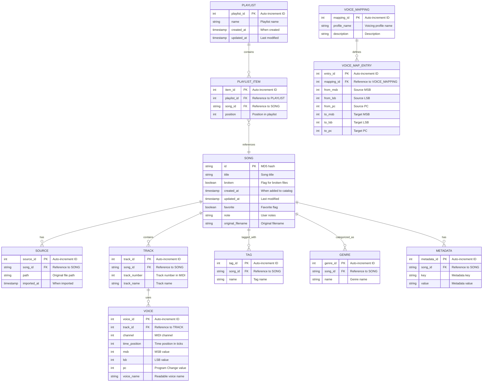

# MIDItoyz Modernization Project Analysis

## Current Architecture Overview

The application is a Python-based CLI tool that helps manage MIDI file collections with a focus on Yamaha Clavinova pianos. Key components include:

1. **Core Functionality**:
   - MIDI file collection management (deduplication, cataloging)
   - Voice/instrument remapping for Yamaha Clavinova pianos
   - Streaming MIDI files to connected devices
   - Metadata management and querying

2. **Technical Implementation**:
   - Single monolithic Python script (~1200 lines)
   - CLI interface using Typer library
   - MIDI file handling with mido
   - Metadata storage using DuckDB
   - Configuration via JSON settings file

3. **Data Storage**:
   - DuckDB database for catalog and metadata
   - JSON files for configuration and catalog backup
   - CSV files for playlists and exports

## Improvement Opportunities

### 1. Code Architecture and Organization

**Current State**: The entire application is in a single Python file with multiple functions and commands.

**Recommendations**:
- **Modular Architecture**: Refactor into a proper Python package with separate modules:
  ```
  miditoyz/
  ├── __init__.py
  ├── cli.py            # CLI interface
  ├── catalog.py        # Catalog management
  ├── database.py       # Database operations
  ├── midi_utils.py     # MIDI file utilities
  ├── streaming.py      # MIDI streaming functionality
  ├── voice_mapping.py  # Voice/instrument mapping
  └── config.py         # Configuration management
  ```
- **Class-based Design**: Convert functional code to class-based for better encapsulation
- **Dependency Injection**: Implement proper dependency injection for better testability

### 2. Error Handling and Robustness

**Current State**: Basic error handling with many try/except blocks that catch all exceptions.

**Recommendations**:
- **Custom Exception Classes**: Create specific exception types for different error scenarios
- **Granular Error Handling**: Catch specific exceptions rather than broad exception catching
- **Logging System**: Implement proper logging instead of print statements
- **Recovery Mechanisms**: Add recovery options for failed operations

### 3. Testing Infrastructure

**Current State**: Minimal testing with a single test file containing one test case.

**Recommendations**:
- **Comprehensive Test Suite**: Unit tests for all core functionality
- **Integration Tests**: Tests for end-to-end workflows
- **Mock Objects**: Use mocks for external dependencies (MIDI devices, filesystem)
- **Test Coverage**: Aim for high test coverage with reporting
- **CI/CD Integration**: Automated testing in a CI/CD pipeline

### 4. User Experience Improvements

**Current State**: Command-line interface with text output.

**Recommendations**:
- **Interactive CLI**: Add interactive prompts using libraries like [questionary](https://github.com/tmbo/questionary)
- **Progress Indicators**: Add progress bars for long-running operations
- **Color-coded Output**: Enhance readability with consistent color schemes
- **Configuration Wizard**: Interactive setup for first-time users
- **Shell Completion**: Improve shell completion scripts

### 5. Modern Python Practices

**Current State**: Uses some modern Python features but could be improved.

**Recommendations**:
- **Type Annotations**: Add comprehensive type hints throughout the codebase
- **Dataclasses**: Use dataclasses for structured data
- **Async I/O**: Implement async for I/O-bound operations
- **Context Managers**: Use context managers for resource management
- **f-strings**: Replace string formatting with f-strings consistently

### 6. Database and Data Management

**Current State**: Uses DuckDB with direct SQL queries.

**Recommendations**:
- **ORM Layer**: Add a simple ORM layer for database operations
- **Migration System**: Implement database migrations for schema changes
- **Query Builder**: Create a query builder to replace raw SQL strings
- **Caching**: Add caching for frequently accessed data
- **Bulk Operations**: Optimize bulk operations for better performance

### 7. Feature Enhancements

**Current State**: Has core functionality but could benefit from additional features.

**Recommendations**:
- **Web Interface**: Implement the planned web frontend with FastAPI
- **REST API**: Create a REST API for programmatic access
- **Advanced Search**: Implement full-text search capabilities
- **Audio Preview**: Add audio preview functionality
- **Batch Processing**: Enhance batch processing capabilities
- **Export/Import**: Improve export/import functionality for sharing
- **Cloud Integration**: Add cloud storage integration options

### 8. Documentation

**Current State**: Basic README and help text.

**Recommendations**:
- **API Documentation**: Generate API docs with tools like Sphinx
- **User Guide**: Create comprehensive user documentation
- **Examples**: Add more examples for common workflows
- **Architecture Documentation**: Document system architecture and design decisions
- **Contributing Guide**: Add guidelines for contributors

## Database Schema Improvements

The current database implementation uses DuckDB with a simple schema created on-the-fly. A more robust and efficient database schema would support better querying, metadata management, and future expansion.

### Current Database Limitations

1. Flat structure with minimal relationships
2. Limited indexing strategy
3. JSON-based storage for complex data (voices, dumps)
4. No schema versioning or migration path
5. Direct SQL queries embedded in code

### Proposed Database Schema



## Web Interface Concept

The web interface would provide a modern, user-friendly way to interact with the MIDI collection, complementing the CLI functionality.

### Architecture


### MIDI Playback Solution

For MIDI playback in the web interface, three approaches are proposed:

1. **Primary Approach - WebMIDI API**:
   - Use the Web MIDI API for browsers that support it
   - Connect to physical MIDI devices directly from the browser
   - Implement voice mapping in JavaScript

2. **Fallback Approach - Server-Side Streaming**:
   - For browsers without Web MIDI API support
   - Stream MIDI events via WebSockets
   - Server connects to physical MIDI devices
   - Voice mapping happens on the server

3. **Hybrid Approach - Client-Side Synthesis**:
   - Use Web Audio API for client-side MIDI synthesis
   - SoundFont-based playback for devices without MIDI hardware
   - Voice mapping happens in JavaScript

### Key Features of the Web Interface

1. **Library Management**:
   - Browse and search MIDI collection
   - Filter by genre, tag, favorites
   - Batch operations (tag, categorize)
   - Visual file browser with thumbnails

2. **Playback Control**:
   - Device selection
   - Voice mapping profiles
   - Playlist management
   - Transport controls (play, pause, stop)
   - Visual track display

3. **Metadata Management**:
   - Edit song metadata
   - Batch tagging
   - Custom fields
   - Import/export metadata

4. **Analysis Tools**:
   - Voice usage visualization
   - Track structure display
   - MIDI event inspector
   - Comparative analysis

## Implementation Plan

A phased approach to implementing these improvements:

### Phase 1: Code Restructuring and Modernization
1. Refactor into modular package structure
2. Add comprehensive type annotations
3. Implement proper error handling and logging
4. Enhance test infrastructure

### Phase 2: User Experience and Core Functionality
1. Improve CLI interface with interactive elements
2. Enhance database layer with ORM-like abstractions
3. Implement configuration wizard
4. Add progress indicators for long operations

### Phase 3: Feature Expansion
1. Develop web interface with FastAPI
2. Implement REST API
3. Add advanced search capabilities
4. Develop cloud integration options

### Phase 4: Documentation and Community
1. Create comprehensive documentation
2. Develop contribution guidelines
3. Set up CI/CD pipeline
4. Create user community resources