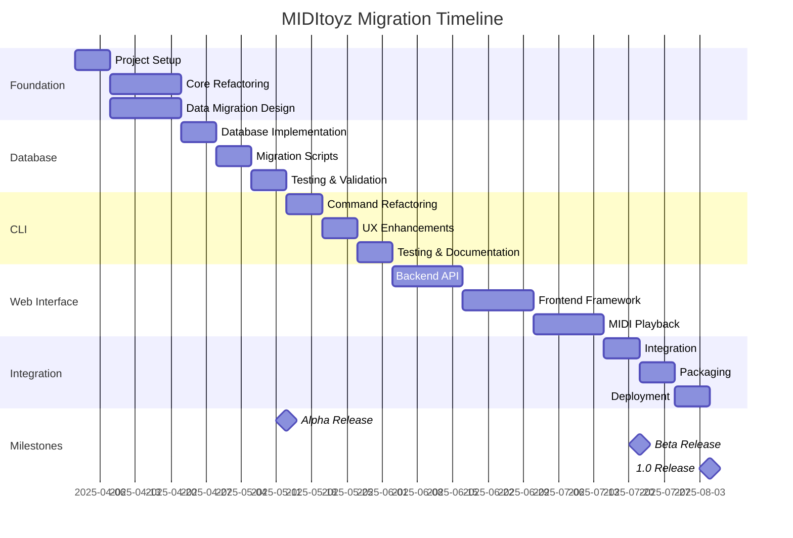

# Comprehensive Migration Plan: Current MIDItoyz to New Architecture

## Overview

This migration plan outlines the transition from the current monolithic MIDItoyz implementation to the proposed modular architecture with enhanced database schema and web interface. The plan prioritizes:

1. Minimal disruption for existing users
2. Data preservation and backward compatibility
3. Incremental implementation with fallback options
4. Comprehensive testing at each stage
5. Clear documentation for both developers and users

## Phase 1: Foundation and Preparation (Weeks 1-3)

### Technical Implementation

#### Week 1: Project Structure and Environment Setup
1. **Create New Repository Structure**
   ```
   miditoyz/
   ├── miditoyz/
   │   ├── __init__.py
   │   ├── cli.py
   │   ├── core/
   │   │   ├── __init__.py
   │   │   ├── catalog.py
   │   │   ├── database.py
   │   │   └── midi_utils.py
   │   ├── models/
   │   │   ├── __init__.py
   │   │   └── schema.py
   │   └── utils/
   │       ├── __init__.py
   │       └── helpers.py
   ├── migrations/
   │   └── versions/
   ├── tests/
   │   ├── __init__.py
   │   └── test_core.py
   ├── scripts/
   │   ├── migrate_data.py
   │   └── install.sh
   ├── pyproject.toml
   └── README.md
   ```

2. **Setup UV-based Environment**
   - Create installation script with UV integration
   - Update miditoyz script with UV shebang:
   ```python
   #!/usr/bin/env -S uv run --script
   # /// script
   # requires-python = ">=3.10"
   # dependencies = [
   #     "mido>=1.2.10",
   #     "typer>=0.9.0",
   #     "rich>=13.4.2",
   #     "duckdb>=0.8.1",
   #     "jinja2>=3.1.2",
   #     "python-rtmidi>=1.5.0",
   # ]
   # ///

   """
   MIDItoyz - MIDI collection management tool with enhanced features
   """
   ```

3. **Create Compatibility Layer**
   - Implement wrapper functions that match current API
   - Add deprecation warnings for future changes

#### Week 2-3: Core Functionality Refactoring
1. **Extract Core Logic**
   - Move core functionality to appropriate modules
   - Add type hints and documentation
   - Implement unit tests for each module

2. **Create Configuration Management**
   - Develop versioned configuration system
   - Add migration path for existing settings.json

3. **Implement Logging System**
   - Add structured logging with Rich
   - Create log rotation and management

### Data Migration Strategy

#### Week 2: Database Schema Design
1. **Create Schema Migration Tool**
   - Implement schema version tracking
   - Design database migration framework
   - Create schema validation tools

2. **Design Schema Conversion**
   - Map current flat structure to new relational schema
   - Create data transformation functions
   - Implement validation checks

#### Week 3: Data Preservation Tools
1. **Backup System**
   - Create automatic backup before migration
   - Implement restore functionality
   - Add verification of backup integrity

2. **Data Validation**
   - Create checksums for critical data
   - Implement validation of migrated data
   - Add reporting for migration issues

### Risk Mitigation
1. **Versioned Backups**: Automatic backup of all user data before any migration
2. **Dry Run Mode**: Test migrations without applying changes
3. **Rollback Capability**: Ability to revert to previous version
4. **Parallel Installation**: Allow both versions to coexist during transition

## Phase 2: Database Migration (Weeks 4-6)

### Technical Implementation

#### Week 4: Database Layer Implementation
1. **Implement Database Models**
   - Create SQLAlchemy models for new schema
   - Add data validation and constraints
   - Implement relationship management

2. **Create Repository Layer**
   - Implement repository pattern for data access
   - Add caching for frequently accessed data
   - Create query builders for complex searches

#### Week 5: Migration Scripts
1. **Develop Migration Framework**
   - Create migration script runner
   - Implement transaction-based migrations
   - Add progress reporting with Rich

2. **Implement Schema Migrations**
   - Create initial schema creation script
   - Add incremental migration scripts
   - Implement data transformation logic

#### Week 6: Testing and Validation
1. **Automated Testing**
   - Create integration tests for database layer
   - Implement migration tests with sample data
   - Add performance benchmarks

2. **Manual Verification**
   - Create verification tools for data integrity
   - Implement comparison reports
   - Add visual data inspection tools

### Data Migration Process

#### Week 4: Data Extraction
1. **Extract Current Data**
   ```python
   def extract_current_data(settings_path, output_path):
       """Extract all data from current implementation to JSON format."""
       # Load settings
       settings = json.load(open(settings_path))
       catalog_path = settings.get("catalog")
       
       # Extract catalog data
       catalog_db = f"{catalog_path}/catalog.db"
       conn = duckdb.connect(catalog_db)
       
       # Extract tables
       data = {
           "songs": conn.execute("SELECT * FROM catalog").fetchall(),
           "tags": conn.execute("SELECT * FROM tag").fetchall(),
           "genres": conn.execute("SELECT * FROM genre").fetchall(),
           "settings": settings,
       }
       
       # Save to intermediate format
       with open(output_path, "w") as f:
           json.dump(data, f, indent=2)
       
       return data
   ```

2. **Data Transformation**
   ```python
   def transform_data(extracted_data):
       """Transform extracted data to new schema format."""
       transformed = {
           "songs": [],
           "sources": [],
           "tracks": [],
           "voices": [],
           "tags": [],
           "genres": [],
           "playlists": [],
           "playlist_items": [],
           "voice_mappings": [],
           "voice_map_entries": [],
           "metadata": [],
       }
       
       # Transform songs
       for song in extracted_data["songs"]:
           # Basic song data
           transformed["songs"].append({
               "id": song["id"],
               "title": song["title"],
               "broken": song["broken"],
               "favorite": song["favorite"],
               "note": song["note"],
               "created_at": datetime.now().isoformat(),
               "updated_at": datetime.now().isoformat(),
           })
           
           # Extract sources from JSON
           sources = json.loads(song["sources"])
           for source in sources:
               transformed["sources"].append({
                   "song_id": song["id"],
                   "path": source,
                   "imported_at": datetime.now().isoformat(),
               })
           
           # Extract voices from JSON
           try:
               voices_data = json.loads(song["voices"])
               for i, track in enumerate(voices_data.get("tracks", [])):
                   track_id = f"{song['id']}_{i}"
                   transformed["tracks"].append({
                       "track_id": track_id,
                       "song_id": song["id"],
                       "track_number": i,
                       "track_name": track.get("title", f"Track {i}"),
                   })
                   
                   for channel in track.get("channels", []):
                       transformed["voices"].append({
                           "track_id": track_id,
                           "channel": channel.get("channel", 0),
                           "time_position": channel.get("time", 0),
                           "msb": channel.get("MSB", 0),
                           "lsb": channel.get("LSB", 0),
                           "pc": channel.get("PC", 1),
                           "voice_name": channel.get("voice", "Unknown"),
                       })
           except:
               # Handle broken voice data
               pass
       
       # Transform tags and genres
       for tag in extracted_data["tags"]:
           transformed["tags"].append({
               "song_id": tag["id"],
               "name": tag["value"],
           })
       
       for genre in extracted_data["genres"]:
           transformed["genres"].append({
               "song_id": genre["id"],
               "name": genre["value"],
           })
       
       # Transform voice mappings
       for name, mapping in extracted_data["settings"].get("voicings", {}).items():
           mapping_id = str(uuid.uuid4())
           transformed["voice_mappings"].append({
               "mapping_id": mapping_id,
               "profile_name": name,
               "description": f"Imported from {name}",
           })
           
           for voice_name, voice_map in mapping.items():
               # Handle different formats
               if isinstance(voice_map[0][0], int):
                   # Single voice mapping
                   transformed["voice_map_entries"].append({
                       "mapping_id": mapping_id,
                       "from_msb": voice_map[0][0],
                       "from_lsb": voice_map[0][1],
                       "from_pc": voice_map[0][2],
                       "to_msb": voice_map[1][0],
                       "to_lsb": voice_map[1][1],
                       "to_pc": voice_map[1][2],
                   })
               else:
                   # Multiple voice mapping
                   for from_voice in voice_map[0]:
                       transformed["voice_map_entries"].append({
                           "mapping_id": mapping_id,
                           "from_msb": from_voice[0],
                           "from_lsb": from_voice[1],
                           "from_pc": from_voice[2],
                           "to_msb": voice_map[1][0],
                           "to_lsb": voice_map[1][1],
                           "to_pc": voice_map[1][2],
                       })
       
       return transformed
   ```

#### Week 5-6: Data Loading and Verification
1. **Load Transformed Data**
   ```python
   def load_transformed_data(transformed_data, db_path):
       """Load transformed data into new database schema."""
       # Create database connection
       engine = create_engine(f"sqlite:///{db_path}")
       Session = sessionmaker(bind=engine)
       session = Session()
       
       try:
           # Load songs
           for song_data in transformed_data["songs"]:
               song = Song(**song_data)
               session.add(song)
           
           # Commit songs first to establish foreign keys
           session.commit()
           
           # Load other entities
           for entity_type, model_class in [
               ("sources", Source),
               ("tracks", Track),
               ("voices", Voice),
               ("tags", Tag),
               ("genres", Genre),
               ("voice_mappings", VoiceMapping),
           ]:
               for item_data in transformed_data[entity_type]:
                   item = model_class(**item_data)
                   session.add(item)
               session.commit()
           
           # Load voice map entries last
           for entry_data in transformed_data["voice_map_entries"]:
               entry = VoiceMapEntry(**entry_data)
               session.add(entry)
           
           session.commit()
           return True
       except Exception as e:
           session.rollback()
           print(f"Error loading data: {e}")
           return False
   ```

2. **Verify Migration**
   ```python
   def verify_migration(old_data, new_db_path):
       """Verify that migration was successful by comparing counts and samples."""
       engine = create_engine(f"sqlite:///{new_db_path}")
       Session = sessionmaker(bind=engine)
       session = Session()
       
       verification = {
           "songs": {
               "old_count": len(old_data["songs"]),
               "new_count": session.query(Song).count(),
               "sample_matches": []
           },
           "tags": {
               "old_count": len(old_data["tags"]),
               "new_count": session.query(Tag).count(),
           },
           "genres": {
               "old_count": len(old_data["genres"]),
               "new_count": session.query(Genre).count(),
           },
       }
       
       # Sample verification of songs
       for i, old_song in enumerate(random.sample(old_data["songs"], min(10, len(old_data["songs"])))):
           new_song = session.query(Song).filter(Song.id == old_song["id"]).first()
           if new_song:
               match = {
                   "id": old_song["id"],
                   "title_match": old_song["title"] == new_song.title,
                   "favorite_match": old_song["favorite"] == new_song.favorite,
               }
               verification["songs"]["sample_matches"].append(match)
       
       return verification
   ```

### Risk Mitigation
1. **Dual Database Mode**: Keep old database during transition
2. **Incremental Migration**: Migrate one table at a time
3. **Validation Checks**: Verify data integrity after each step
4. **Automatic Rollback**: Revert on validation failure

## Phase 3: CLI Refactoring (Weeks 7-9)

### Technical Implementation

#### Week 7: Command Structure Refactoring
1. **Implement New CLI Framework**
   - Refactor using Typer with Rich integration
   - Create command groups for better organization
   - Add comprehensive help text and examples

2. **Create Command Handlers**
   - Implement handlers for each command
   - Add input validation and error handling
   - Create progress indicators for long operations

#### Week 8: User Experience Enhancements
1. **Implement Rich UI Components**
   - Add tables, panels, and progress bars
   - Implement color schemes and styling
   - Create interactive prompts

2. **Add New CLI Features**
   - Implement interactive mode
   - Add batch processing capabilities
   - Create export/import functionality

#### Week 9: Testing and Documentation
1. **CLI Testing**
   - Create automated tests for CLI commands
   - Implement integration tests with database
   - Add user acceptance testing

2. **Documentation**
   - Create comprehensive CLI documentation
   - Add examples and tutorials
   - Create migration guide for users

### Data Access Strategy
1. **Repository Pattern**
   - Implement repositories for data access
   - Add caching for frequently accessed data
   - Create query builders for complex searches

2. **Command Handlers**
   - Create handlers for each CLI command
   - Implement input validation and error handling
   - Add progress reporting and feedback

### Risk Mitigation
1. **Command Aliases**: Support old command syntax
2. **Gradual Feature Introduction**: Add new features incrementally
3. **Feature Flags**: Allow disabling new features
4. **Comprehensive Help**: Enhanced help system for new commands

## Phase 4: Web Interface Development (Weeks 10-15)

### Technical Implementation

#### Week 10-11: Backend API
1. **FastAPI Implementation**
   - Create REST API endpoints
   - Implement authentication and authorization
   - Add WebSocket support for real-time updates

2. **MIDI Service**
   - Implement MIDI device management
   - Create streaming service
   - Add voice mapping functionality

#### Week 12-13: Frontend Framework
1. **Vue.js/React Setup**
   - Create component structure
   - Implement routing and state management
   - Add responsive design

2. **Core UI Components**
   - Implement song browser
   - Create playlist manager
   - Add metadata editor

#### Week 14-15: MIDI Playback
1. **Web MIDI Implementation**
   - Add Web MIDI API support
   - Implement fallback mechanisms
   - Create visualization components

2. **Integration and Testing**
   - End-to-end testing
   - Performance optimization
   - Browser compatibility testing

### Data Access Strategy
1. **API Layer**
   - Create RESTful API for data access
   - Implement GraphQL for complex queries
   - Add WebSocket for real-time updates

2. **Authentication and Authorization**
   - Implement JWT-based authentication
   - Add role-based access control
   - Create API key management

### Risk Mitigation
1. **Progressive Enhancement**: Core functionality works without JavaScript
2. **Fallback Mechanisms**: Multiple MIDI playback options
3. **Feature Detection**: Adapt to browser capabilities
4. **Offline Support**: Basic functionality works offline

## Phase 5: Integration and Deployment (Weeks 16-18)

### Technical Implementation

#### Week 16: Integration
1. **CLI and Web Integration**
   - Ensure consistent behavior between interfaces
   - Add cross-platform compatibility
   - Create shared configuration

2. **Final Testing**
   - End-to-end testing
   - Performance benchmarking
   - Security testing

#### Week 17: Packaging and Distribution
1. **Package Creation**
   - Create installable packages
   - Add platform-specific installers
   - Implement auto-update mechanism

2. **Documentation**
   - Create comprehensive documentation
   - Add tutorials and examples
   - Create migration guide

#### Week 18: Deployment and Launch
1. **Beta Release**
   - Release to beta testers
   - Collect feedback and fix issues
   - Finalize documentation

2. **Official Release**
   - Create release announcement
   - Publish packages
   - Provide migration support

### Data Migration for Production
1. **Migration Wizard**
   - Create interactive migration tool
   - Add progress reporting and error handling
   - Implement automatic backup

2. **Verification Tools**
   - Create data verification utilities
   - Add reporting for migration issues
   - Implement automatic rollback on failure

### Risk Mitigation
1. **Phased Rollout**: Gradual release to users
2. **Support Channels**: Dedicated support for migration issues
3. **Extended Compatibility**: Support for old format during transition
4. **Comprehensive Documentation**: Clear migration instructions

## Timeline and Milestones



## Risk Assessment and Mitigation Strategies

| Risk | Impact | Probability | Mitigation Strategy |
|------|--------|------------|---------------------|
| Data loss during migration | High | Low | Automatic backups, verification checks, rollback capability |
| Breaking changes for users | Medium | Medium | Compatibility layer, gradual feature introduction, comprehensive documentation |
| Performance issues with new database | Medium | Low | Performance testing, indexing strategy, query optimization |
| Browser compatibility issues | Medium | Medium | Progressive enhancement, feature detection, fallback mechanisms |
| Migration complexity overwhelming users | High | Medium | Migration wizard, support channels, clear documentation |
| Dependency conflicts | Medium | Low | Virtual environments, dependency pinning, compatibility testing |
| Security vulnerabilities | High | Low | Security audits, authentication system, input validation |

## User Communication Plan

1. **Pre-Migration**
   - Announce upcoming changes
   - Provide migration timeline
   - Collect user feedback

2. **During Migration**
   - Regular progress updates
   - Beta testing opportunities
   - Support channels for issues

3. **Post-Migration**
   - Release notes and documentation
   - Tutorial videos and examples
   - Feedback collection for improvements

## Conclusion

This comprehensive migration plan provides a structured approach to transitioning from the current MIDItoyz implementation to the new architecture. By focusing on data preservation, backward compatibility, and incremental implementation, we can ensure a smooth transition for existing users while introducing powerful new features and improvements.

The plan includes detailed technical implementation steps, data migration strategies, and risk mitigation approaches to address potential issues. With careful planning and execution, we can successfully modernize the MIDItoyz application while maintaining its core functionality and user experience.